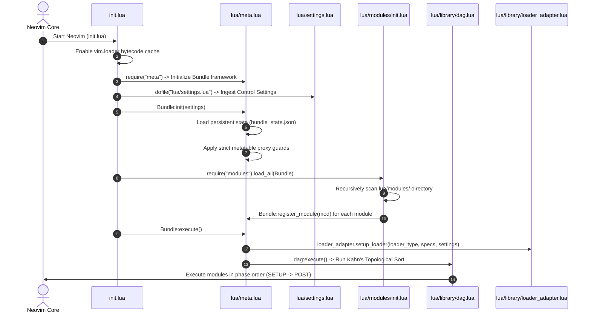
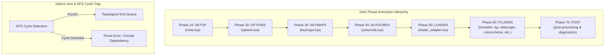
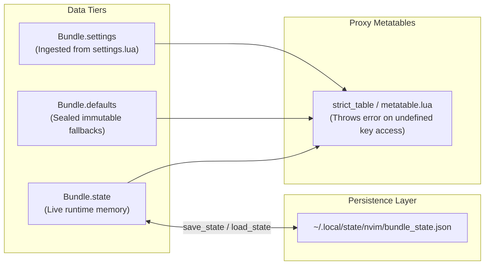
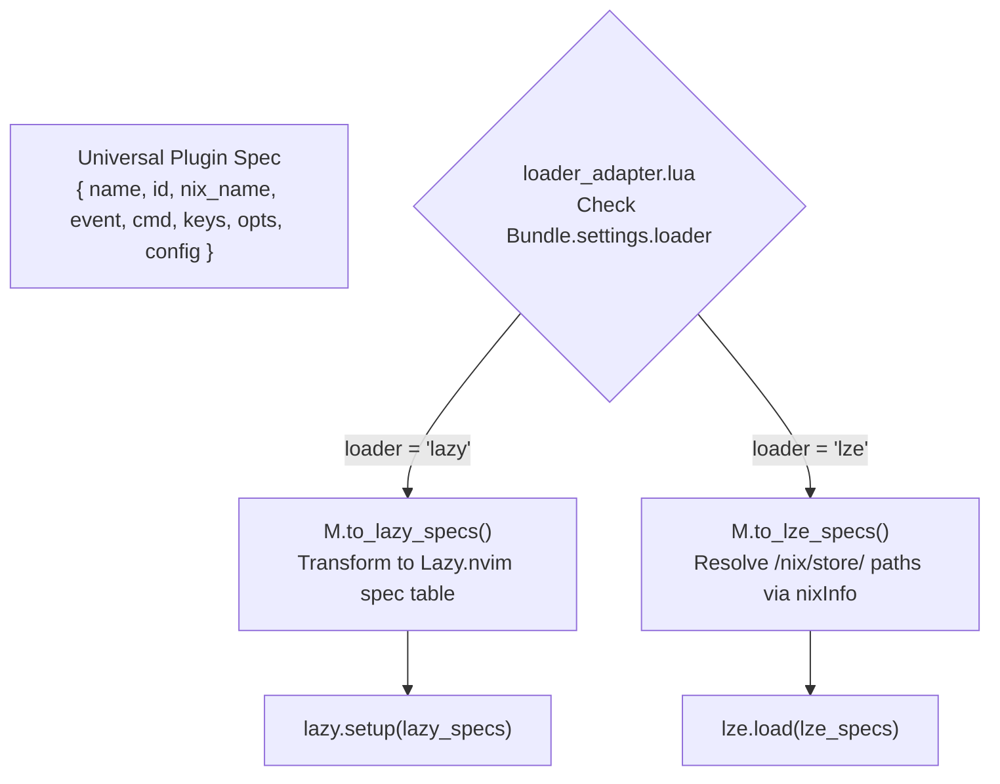
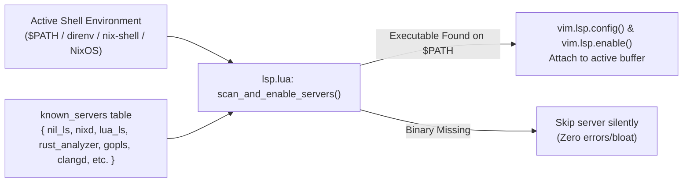
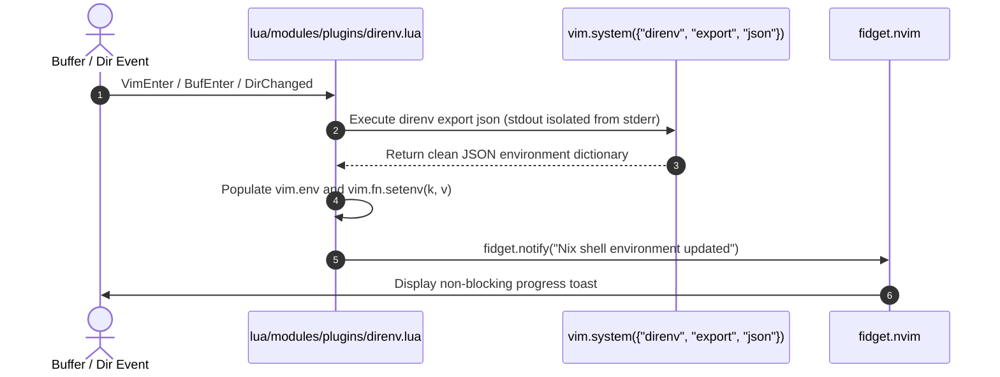

# Neovim Modular DAG Configuration Architecture & Developer Guide

Welcome to the definitive architecture documentation for the **Modular DAG Neovim Configuration Engine**. 

This document is engineered to serve as a complete technical blueprint. Whether you are a Neovim novice or a core contributor, reading this guide will allow you to understand, navigate, reverse-engineer, and extend every system component within this repository.

---

## 📐 Table of Contents

1. [Executive Architectural Summary](#1-executive-architectural-summary)
2. [Codebase Directory & File Taxonomy](#2-codebase-directory--file-taxonomy)
3. [Control Flow & Execution Engine Diagrams](#3-control-flow--execution-engine-diagrams)
   - [3.1 Boot Initialization Sequence](#31-boot-initialization-sequence)
   - [3.2 Topological DAG Execution Pipeline](#32-topological-dag-execution-pipeline)
   - [3.3 Decoupled 3-Tier Data Architecture & Metatable Locking](#33-decoupled-3-tier-data-architecture--metatable-locking)
   - [3.4 Dual-Engine Loader Translation Pipeline (Lazy vs Lze)](#34-dual-engine-loader-translation-pipeline-lazy-vs-lze)
   - [3.5 Mason-Free Dynamic Environment Sourcing](#35-mason-free-dynamic-environment-sourcing)
   - [3.6 Treesitter Dual-Mode Auto-Attach Engine](#36-treesitter-dual-mode-auto-attach-engine)
   - [3.7 Direnv Environment & Fidget Notification Sync](#37-direnv-environment--fidget-notification-sync)
4. [Universal Plugin Specification Format](#4-universal-plugin-specification-format)
5. [Developer Guide: How to Add & Modify Features](#5-developer-guide-how-to-add--modify-features)
   - [Template 1: Adding a Standard UI / Utility Plugin](#template-1-adding-a-standard-ui--utility-plugin)
   - [Template 2: Adding a Language Tooling / LSP Plugin](#template-2-adding-a-language-tooling--lsp-plugin)
   - [Template 3: Registering Plugins for Nix / NixOS (`module.nix` & `flake.nix`)](#template-3-registering-plugins-for-nix--nixos-modulenix--flakenix)
6. [System Diagnostic Commands](#6-system-diagnostic-commands)

---

## 1. Executive Architectural Summary

Traditional Neovim configurations suffer from order-dependent initialization bugs, monolithic `init.lua` bloat, tight coupling between plugins, and hard dependencies on external package managers like Mason under NixOS.

This repository solves these challenges using **5 core architectural pillars**:

1. **Topological Execution Graph (DAG)**: Configuration is structured as nodes in an Acyclic Directed Graph with priority phases (`SETUP` $\rightarrow$ `OPTIONS` $\rightarrow$ `KEYMAPS` $\rightarrow$ `AUTOCMDS` $\rightarrow$ `LOADER` $\rightarrow$ `PLUGINS` $\rightarrow$ `POST`). Execution order is mathematically resolved via Kahn's algorithm with Depth-First Search (DFS) cycle protection.
2. **Decoupled 3-Tier Data Model**:
   - `Bundle.settings`: Ingested static preferences ([`lua/settings.lua`](file:///home/addy/.config/nvim/lua/settings.lua)).
   - `Bundle.defaults`: Sealed immutable fallback tables.
   - `Bundle.state`: Live runtime state with cross-session JSON persistence (`~/.local/state/nvim/bundle_state.json`).
3. **Strict Metatable Encapsulation**: Read/write access to settings and state is guarded by proxy metatables (`meta.seal()`), preventing silent global variable pollution and catching typo bugs instantly.
4. **Dual-Engine Declarative Loader Adapter**: A single universal plugin specification automatically translates to either `lazy.nvim` (traditional Git cloning) or `lze` (Nix `/nix/store` derivation resolution).
5. **Mason-Free Environment Sourcing**: Language servers, formatters, linters, and debuggers are dynamically detected from `$PATH` (populated by `direnv`, `nix-shell`, `nix develop`, or system binaries) without requiring Mason under NixOS.

---

## 2. Codebase Directory & File Taxonomy

```
.
├── init.lua                        # Neovim entrypoint & bootstrap pipeline
├── flake.nix                       # Nix Flake derivation output & plugin inputs
├── module.nix                      # Nix Wrapper Module specs & runtimePkgs bundling
├── progress.md                     # Development roadmap & feature audit log
├── ARCHITECTURE.md                 # This architecture documentation blueprint
├── lua/
│   ├── settings.lua                # Control plane feature toggles & settings
│   ├── meta.lua                    # Bundle framework core, state persistence & sealing
│   ├── library/
│   │   ├── dag.lua                 # Kahn's topological sort & cycle detection engine
│   │   ├── loader_adapter.lua      # Universal spec translator for Lazy.nvim / lze
│   │   ├── logger.lua              # Structured microsecond logging framework
│   │   └── metatable.lua           # Proxy table sealing & strict immutability guards
│   └── modules/
│       ├── init.lua                # Recursive module scanner & registrar
│       ├── options.lua             # Vim options & persistent line number toggles
│       ├── keymaps.lua             # Essential keybindings & LSP float diagnostic keys
│       ├── autocmds.lua            # Global autocommands
│       ├── kitty.lua               # Kitty terminal padding integration
│       └── plugins/                # Modular plugin specifications
│           ├── autopairs.lua       # Auto-closing bracket pairs
│           ├── blink_cmp.lua       # Blink.cmp completion engine & build fallback
│           ├── colorscheme.lua     # Curated theme collection & :Colorscheme command
│           ├── direnv.lua          # NotAShelf/direnv.nvim environment sync
│           ├── fidget.lua          # LSP progress & notification UI
│           ├── file_explorer.lua   # NvimTree file explorer
│           ├── formatter.lua       # Conform.nvim formatting engine
│           ├── linter.lua          # Nvim-lint linting engine
│           ├── lsp.lua             # Environment-sourced LSP manager
│           ├── lualine.lua         # Statusline with active tooling indicators
│           ├── mason.lua           # Mason fallback for non-Nix environments
│           ├── render_markdown.lua # Markdown previewer
│           ├── telescope.lua       # Telescope fuzzy finder
│           ├── transparency.lua    # All-or-nothing UI transparency engine
│           ├── treesitter.lua      # Treesitter syntax highlighter & textobjects
│           └── which_key.lua       # Keymap hint popup
└── tests/
    └── run_tests.lua               # Automated unit test suite (DAG, metatables, state)
```

---

## 3. Control Flow & Execution Engine Diagrams

### 3.1 Boot Initialization Sequence

When Neovim starts up, [`init.lua`](file:///home/addy/.config/nvim/init.lua) orchestrates the boot pipeline in 6 deterministic stages:



---

### 3.2 Topological DAG Execution Pipeline

Every module declares an `id`, an execution `phase`, and a list of node dependencies `deps`. [`lua/library/dag.lua`](file:///home/addy/.config/nvim/lua/library/dag.lua) sorts these modules into a linear execution queue while guaranteeing cycle safety.



---

### 3.3 Decoupled 3-Tier Data Architecture & Metatable Locking

To ensure modules are completely decoupled, configuration data is organized into three distinct tiers. Direct module-to-module `require()` imports are strictly forbidden.



---

### 3.4 Dual-Engine Loader Translation Pipeline (Lazy vs Lze)

Modules export universal plugin specifications. [`lua/library/loader_adapter.lua`](file:///home/addy/.config/nvim/lua/library/loader_adapter.lua) translates these universal specs into format-specific structures depending on whether traditional Git loading (`lazy.nvim`) or Nix store derivation loading (`lze`) is active.



---

### 3.5 Mason-Free Dynamic Environment Sourcing

Instead of downloading unpatched binaries, [`lua/modules/plugins/lsp.lua`](file:///home/addy/.config/nvim/lua/modules/plugins/lsp.lua) scans Neovim's active `$PATH` for language server binaries and attaches them dynamically.



---

### 3.6 Treesitter Dual-Mode Auto-Attach Engine

Syntax highlighting uses a dual-mode `FileType` autocommand engine ([`lua/modules/plugins/treesitter.lua`](file:///home/addy/.config/nvim/lua/modules/plugins/treesitter.lua)) that works seamlessly under both Nix and non-Nix environments.

```mermaid
flowchart TD
    FileType["FileType Event Fired<br/>(e.g., filetype = 'elixir' or 'nix')"]
    Check["treesitter_try_attach(buf, lang)<br/>vim.treesitter.language.add(lang)"]

    FileType --> Check
    Check -->|Parser Exists (Nix withAllGrammars)| Start["vim.treesitter.start(buf, lang)<br/>Enable folds & indentexpr"]
    Check -->|Parser Missing (Non-Nix)| CLI{"Check has_ts_cli<br/>(tree-sitter CLI executable)"}

    CLI -->|CLI Available| Install["ts_mod.install(lang):await()<br/>Compile & Attach"]
    CLI -->|CLI Missing| Warn["vim.notify_once()<br/>Warn missing tree-sitter-cli"]
```

---

### 3.7 Direnv Environment & Fidget Notification Sync

Environment variables from `flake.nix` + `.envrc` are ingested into Neovim via [`lua/modules/plugins/direnv.lua`](file:///home/addy/.config/nvim/lua/modules/plugins/direnv.lua) using `NotAShelf/direnv.nvim` and `fidget.nvim`.



---

## 4. Universal Plugin Specification Format

When defining a plugin in `lua/modules/plugins/`, use the universal specification format. Fields are mapped dynamically by `loader_adapter.lua`:

```lua
{
  name = "author/plugin-repo.nvim",   -- GitHub repository name
  id = "plugin-repo",                 -- Unique identifier key
  nix_name = "plugin-repo-nvim",      -- Optional Nixpkgs vimPlugins attribute name
  lazy = true,                         -- Lazy load flag (true/false)
  priority = 100,                      -- Load priority (e.g. 1000 for active colorscheme)
  event = { "BufReadPost", "BufNewFile" }, -- Autocmd trigger events
  cmd = { "CommandName" },             -- Command trigger names
  keys = {                             -- Keymap trigger specs
    { "<leader>ff", "<cmd>Telescope find_files<CR>", desc = "Find files" }
  },
  opts = {                             -- Table passed automatically to require("plugin").setup(opts)
    setting_key = "value",
  },
  config = function(_, opts)           -- Custom configuration callback
    require("plugin").setup(opts)
  end,
}
```

---

## 5. Developer Guide: How to Add & Modify Features

### Template 1: Adding a Standard UI / Utility Plugin

To add a new utility plugin (for example, `gitsigns.nvim`), create a new file in [`lua/modules/plugins/gitsigns.lua`](file:///home/addy/.config/nvim/lua/modules/plugins/gitsigns.lua):

```lua
--- Gitsigns Plugin Module Spec
local dag_lib = require("library.dag")

return {
  id = "gitsigns",
  phase = dag_lib.Phases.PLUGINS,
  deps = { "options", "keymaps" },
  specs = {
    {
      name = "lewis6991/gitsigns.nvim",
      id = "gitsigns",
      nix_name = "gitsigns-nvim",
      event = { "BufReadPost", "BufNewFile" },
      opts = {
        signs = {
          add = { text = "+" },
          change = { text = "~" },
          delete = { text = "_" },
        },
      },
      config = function(_, opts)
        local ok, gitsigns = pcall(require, "gitsigns")
        if ok then
          gitsigns.setup(opts)
        end
      end,
    },
  },
  exec = function() end,
}
```

*That's it!* The module scanner ([`lua/modules/init.lua`](file:///home/addy/.config/nvim/lua/modules/init.lua)) automatically discovers and registers your new file into the DAG pipeline on boot.

---

### Template 2: Adding a Language Tooling / LSP Plugin

To register a new Language Server, open [`lua/modules/plugins/lsp.lua`](file:///home/addy/.config/nvim/lua/modules/plugins/lsp.lua) and add an entry to the `known_servers` table:

```lua
{ 
  name = "elixirls", 
  bin = "elixir-ls", 
  ft = { "elixir", "heex", "eex" },
  settings = {
    elixirLS = {
      dialyzerEnabled = true,
    },
  },
},
```

---

### Template 3: Registering Plugins for Nix / NixOS (`module.nix` & `flake.nix`)

If you build your configuration with Nix (`nix build .`), register your plugin in both Nix files:

1. **In [`flake.nix`](file:///home/addy/.config/nvim/flake.nix)**: Add the GitHub repository input if it's outside Nixpkgs:
   ```nix
   inputs.plugins-gitsigns-nvim = {
     url = "github:lewis6991/gitsigns.nvim";
     flake = false;
   };
   ```
2. **In [`module.nix`](file:///home/addy/.config/nvim/module.nix)**: Add the plugin attribute to `config.specs.general`:
   ```nix
   config.specs.general = with pkgs.vimPlugins; [
     gitsigns-nvim
     # ...
   ];
   ```

---

## 6. System Diagnostic Commands

| Command | Module File | Description |
| :--- | :--- | :--- |
| `:DagStatus` | [`init.lua`](file:///home/addy/.config/nvim/init.lua#L43) | Prints execution statistics (total executed nodes, failed nodes, microsecond execution time). |
| `:DagLog` | [`init.lua`](file:///home/addy/.config/nvim/init.lua#L49) | Opens a split buffer containing the complete structured execution log. |
| `:BundleInfo` | [`init.lua`](file:///home/addy/.config/nvim/init.lua#L60) | Displays global Bundle metadata (active loader, Nix state, registered specs count). |
| `:Colorscheme <Tab>` | [`colorscheme.lua`](file:///home/addy/.config/nvim/lua/modules/plugins/colorscheme.lua) | Switch theme with full autocompletion across all 20 installed variants. |
| `:ToggleTransparency` | [`transparency.lua`](file:///home/addy/.config/nvim/lua/modules/plugins/transparency.lua) | Toggle all-or-nothing UI background transparency. |
| `:ToggleFormatOnSave` | [`keymaps.lua`](file:///home/addy/.config/nvim/lua/modules/keymaps.lua) | Toggle automatic format-on-save behavior. |
| `:ToggleFormatter` | [`keymaps.lua`](file:///home/addy/.config/nvim/lua/modules/keymaps.lua) | Toggle automatic formatter attachment. |
| `:ToggleLinter` | [`keymaps.lua`](file:///home/addy/.config/nvim/lua/modules/keymaps.lua) | Toggle automatic linter attachment. |
| `:ToggleDAP` | [`keymaps.lua`](file:///home/addy/.config/nvim/lua/modules/keymaps.lua) | Toggle automatic DAP debugger attachment. |
