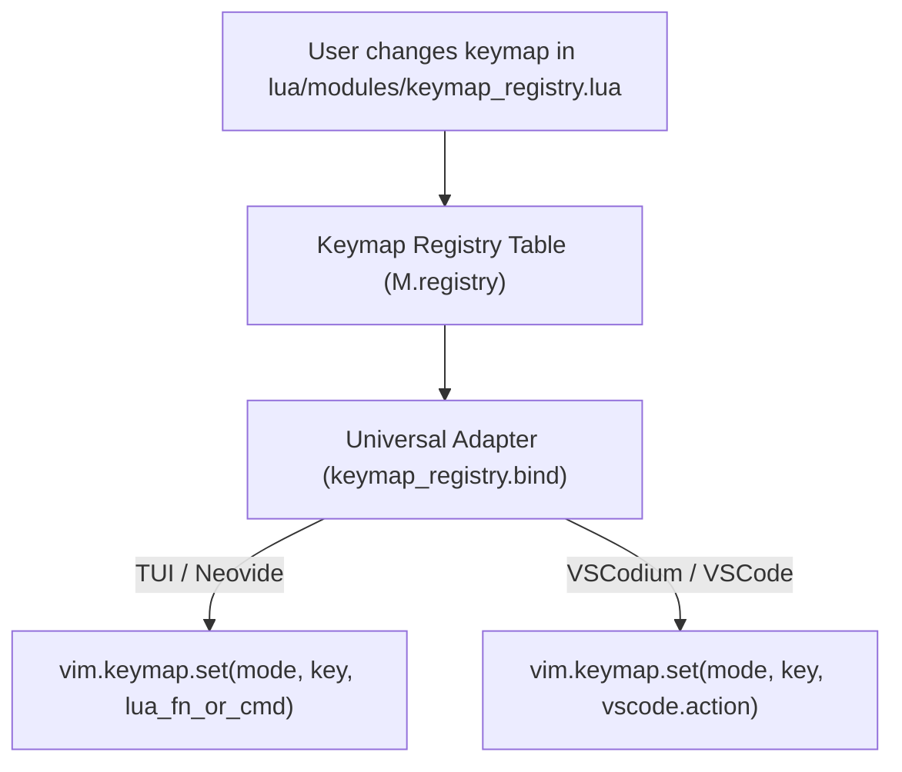

# Neovim Modular DAG Configuration Architecture & Developer Guide

Welcome to the definitive architecture documentation for the **Modular DAG Neovim Configuration Engine**. 

This document is engineered to serve as a complete technical blueprint. Whether you are a Neovim novice or a core contributor, reading this guide will allow you to understand, navigate, reverse-engineer, and extend every system component within this repository.

---

## 📐 Table of Contents

1. [Executive Architectural Summary](#1-executive-architectural-summary)
2. [Codebase Directory & File Taxonomy](#2-codebase-directory--file-taxonomy)
3. [Control Flow & Execution Engine Diagrams](#3-control-flow--execution-engine-diagrams)
   - [3.1 Boot Initialization Sequence](#31-boot-initialization-sequence)
   - [3.2 Topological DAG Execution Pipeline](#32-topological-dag-execution-pipeline)
   - [3.3 Decoupled 3-Tier Data Architecture & Metatable Locking](#33-decoupled-3-tier-data-architecture--metatable-locking)
   - [3.4 Dual-Engine Loader Translation Pipeline (Lazy vs Lze)](#34-dual-engine-loader-translation-pipeline-lazy-vs-lze)
   - [3.5 Mason-Free Dynamic Environment Sourcing](#35-mason-free-dynamic-environment-sourcing)
   - [3.6 Treesitter Dual-Mode Auto-Attach Engine](#36-treesitter-dual-mode-auto-attach-engine)
   - [3.7 Direnv Environment & Fidget Notification Sync](#37-direnv-environment--fidget-notification-sync)
   - [3.8 Centralized Keymap Syncer & Universal Adapter Engine](#38-centralized-keymap-syncer--universal-adapter-engine)
4. [Universal Plugin Specification Format](#4-universal-plugin-specification-format)
5. [Developer Guide: How to Add & Modify Features](#5-developer-guide-how-to-add--modify-features)
   - [Template 1: Adding a Standard UI / Utility Plugin](#template-1-adding-a-standard-ui--utility-plugin)
   - [Template 2: Adding a Language Tooling / LSP Plugin](#template-2-adding-a-language-tooling--lsp-plugin)
   - [Template 3: Registering Plugins for Nix / NixOS (`module.nix` & `flake.nix`)](#template-3-registering-plugins-for-nix--nixos-modulenix--flakenix)
6. [System Diagnostic Commands](#6-system-diagnostic-commands)

---

## 1. Executive Architectural Summary

Traditional Neovim configurations suffer from order-dependent initialization bugs, monolithic `init.lua` bloat, tight coupling between plugins, and hard dependencies on external package managers like Mason under NixOS.

This repository solves these challenges using **6 core architectural pillars**:

1. **Topological Execution Graph (DAG)**: Configuration is structured as nodes in an Acyclic Directed Graph with priority phases (`SETUP` $\rightarrow$ `OPTIONS` $\rightarrow$ `KEYMAPS` $\rightarrow$ `AUTOCMDS` $\rightarrow$ `LOADER` $\rightarrow$ `PLUGINS` $\rightarrow$ `POST`). Execution order is mathematically resolved via Kahn's algorithm with Depth-First Search (DFS) cycle protection.
2. **Decoupled 3-Tier Data Model**:
   - `Bundle.settings`: Ingested static preferences ([`lua/settings.lua`](file:///home/addy/.config/nvim/lua/settings.lua)).
   - `Bundle.defaults`: Sealed immutable fallback tables.
   - `Bundle.state`: Live runtime state with cross-session JSON persistence (`~/.local/state/nvim/bundle_state.json`).
3. **Strict Metatable Encapsulation**: Read/write access to settings and state is guarded by proxy metatables (`meta.seal()`), preventing silent global variable pollution and catching typo bugs instantly.
4. **Dual-Engine Declarative Loader Adapter**: A single universal plugin specification automatically translates to either `lazy.nvim` (traditional Git cloning) or `lze` (Nix `/nix/store` derivation resolution).
5. **Mason-Free Environment Sourcing**: Language servers, formatters, linters, and debuggers are dynamically detected from `$PATH` (populated by `direnv`, `nix-shell`, `nix develop`, or system binaries) without requiring Mason under NixOS.
6. **Centralized Keymap Syncer**: Semantic keybindings are defined once in [`lua/modules/keymap_registry.lua`](file:///home/addy/.config/nvim/lua/modules/keymap_registry.lua) and automatically adapt between Neovim TUI, Neovide, and VSCodium.

---

## 2. Codebase Directory & File Taxonomy

```
.
├── init.lua                        # Neovim entrypoint & bootstrap pipeline
├── flake.nix                       # Nix Flake derivation output & plugin inputs
├── module.nix                      # Nix Wrapper Module specs & runtimePkgs bundling
├── progress.md                     # Development roadmap & feature audit log
├── ARCHITECTURE.md                 # This architecture documentation blueprint
├── lua/
│   ├── settings.lua                # Control plane feature toggles & settings
│   ├── meta.lua                    # Bundle framework core, state persistence & sealing
│   ├── library/
│   │   ├── dag.lua                 # Kahn's topological sort & cycle detection engine
│   │   ├── loader_adapter.lua      # Universal spec translator for Lazy.nvim / lze
│   │   ├── logger.lua              # Structured microsecond logging framework
│   │   └── metatable.lua           # Proxy table sealing & strict immutability guards
│   └── modules/
│       ├── init.lua                # Recursive module scanner & registrar
│       ├── options.lua             # Vim options & persistent line number toggles
│       ├── keymaps.lua             # Essential keybindings & LSP float diagnostic keys
│       ├── keymap_registry.lua     # Centralized keymap registry & universal adapter
│       ├── gui.lua                 # Neovide, VSCode/VSCodium, & Headless mode engine
│       ├── autocmds.lua            # Global autocommands
│       ├── kitty.lua               # Kitty terminal padding integration
│       └── plugins/                # Modular plugin specifications
│           ├── autopairs.lua       # Auto-closing bracket pairs
│           ├── blink_cmp.lua       # Blink.cmp completion engine & build fallback
│           ├── colorscheme.lua     # Curated theme collection & :Colorscheme command
│           ├── dap.lua             # Nvim-dap debugger client & UI panels
│           ├── direnv.lua          # NotAShelf/direnv.nvim environment sync
│           ├── fidget.lua          # LSP progress & notification UI
│           ├── file_explorer.lua   # NvimTree file explorer
│           ├── formatter.lua       # Conform.nvim formatting engine
│           ├── linter.lua          # Nvim-lint linting engine
│           ├── lsp.lua             # Environment-sourced LSP manager
│           ├── lualine.lua         # Statusline with active tooling indicators
│           ├── mason.lua           # Mason fallback for non-Nix environments
│           ├── render_markdown.lua # Markdown previewer
│           ├── telescope.lua       # Telescope fuzzy finder
│           ├── transparency.lua    # All-or-nothing UI transparency engine
│           ├── treesitter.lua      # Treesitter syntax highlighter & textobjects
│           └── which_key.lua       # Keymap hint popup
└── tests/
    └── run_tests.lua               # Automated unit test suite (DAG, metatables, state)
```

---

## 3. Control Flow & Execution Engine Diagrams

### 3.8 Centralized Keymap Syncer & Universal Adapter Engine



#### Technical Design:
1. **Single Source of Truth**: All semantic keybindings (`close_buffer`, `toggle_tree`, `find_files`, `save_file`, `format_buffer`, `toggle_bp`) are defined once in [`lua/modules/keymap_registry.lua`](file:///home/addy/.config/nvim/lua/modules/keymap_registry.lua).
2. **Environment Auto-Sensing**: When Neovim boots inside VSCodium (`vim.g.vscode ~= nil`), `keymap_registry.bind` automatically attaches the keybinding to VSCode's native internal command bus (`require("vscode").action(...)`). When running in terminal Neovim or Neovide, it binds to Neovim's Lua functions or Vim commands.
3. **Zero Key String Duplication**: Changing a keymap in `keymap_registry.lua` updates both Neovim TUI and VSCodium simultaneously without code duplication.
